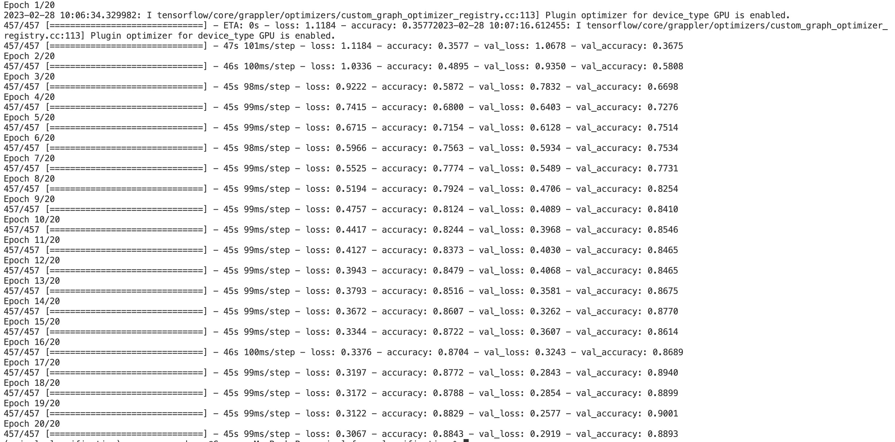
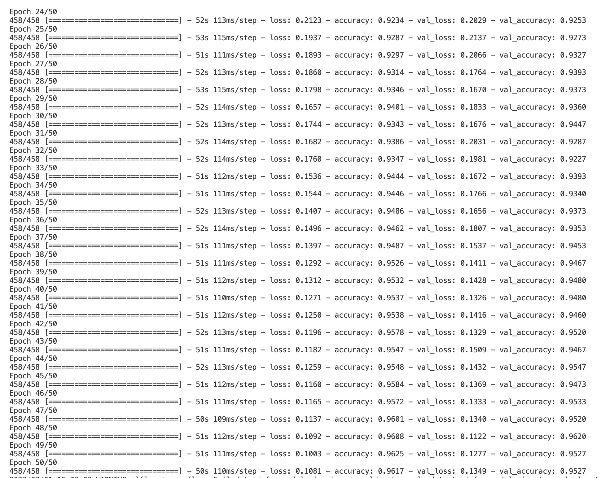
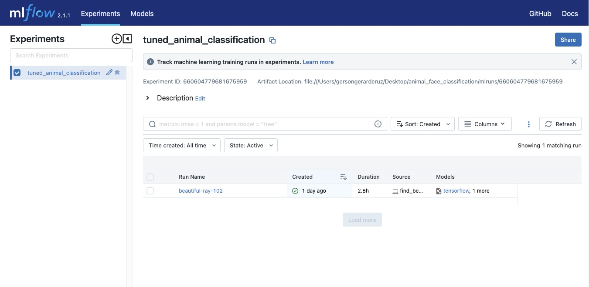
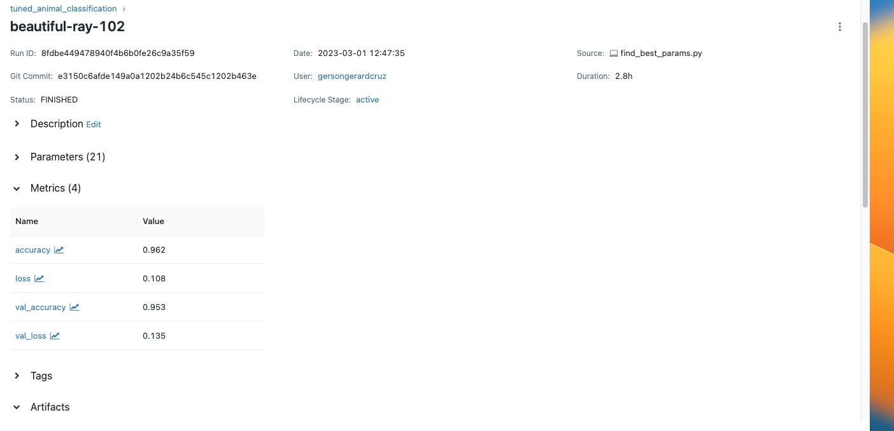

# End-to-End Animal Face Classifier using Keras, Keras Tuner, Mlflow, SQLite, Streamlit, and FastAPI

## Project Information

This is primarily a project meant for fun and learning because who doesn't love looking at cute animals while doing work?

On a more serious note, this project uses a Keras Sequential model, fine-tuned with KerasTuner, to classify animal faces into three categories: **cat, dog, and wildlife**. 

Training and validation images were downloaded from Kaggle's [Animal Faces Dataset](https://www.kaggle.com/datasets/andrewmvd/animal-faces).The images were stored locally and their file paths were stored in an SQLite database so that the training and deployment scripts can acess this database to get image file paths and feed them to the model. This is done to **simulate cloud environments, where we store the locations of objects in a database like AWS RDS, while storing the actual objects in AWS S3 buckets**.

To serve the model, the project uses Streamlit for the frontend connected with FastAPI in the backend. Users are able to upload an image and have the model serve its prediction. In addition, the project can also recommend and display similar images based on the prediction of the model by accessing the SQLite database and displaying images with the same label.

While this project is an educational one, I found that there is value to be derived from the use of animal classification models because they have a wide range of applications in various fields such as wildlife conservation, animal behavior analysis, animal ecology, and animal identification.

## Business Value

To be more specific, here are some applications wherein businesses and organizations using animal face classification/animal classification models can derive value: 

1. Enhanced customer experience: Animal face classification can be used in industries such as pet stores, animal shelters, and zoos, to improve customer experiences. For example, a pet store can use the technology to help match customers with their perfect pet based on facial features and expressions.
2. Streamlined research and analysis: Researchers can use animal face classification models to quickly and accurately categorize large amounts of data, such as images from camera traps or satellite imagery. This can lead to more efficient and accurate research, with potential applications in fields such as ecology, biology, and conservation.
3. Improved animal welfare: Animal face classification models can help identify and monitor animal populations in the wild, aiding in conservation efforts and preventing animal poaching.
4. Enhanced wildlife conservation efforts: Animal face classification models can aid in the conservation of endangered species by allowing researchers to accurately identify and track animals in the wild. For example, the model can be used to identify individual animals and track their movements and behavior patterns, providing valuable data for conservation efforts. This can lead to improved conservation strategies and ultimately help to protect endangered species from extinction.

## Technical Value

On a more technical note, a team can generate value from utilizing Keras, Mlflow, separate locations for image paths and images, and SQLite databases in the development of the animal classification model because of the following:

### Keras:

- User-friendly API: Keras provides a simple and user-friendly API for building neural networks. It allows users to build a neural network model by adding layers to a Sequential model or by defining the model as a graph of layers. This makes it easier for beginners to build their own models.
- Pre-trained models and transfer learning: Keras provides a variety of pre-trained models that can be fine-tuned for specific tasks using transfer learning. This allows users to take advantage of state-of-the-art models that have been trained on large datasets, without having to train them from scratch.
- Tuning: Keras models have access to KerasTuner which automates the tuning process and saves time and effort that would have been required to manually optimize the model’s performance.

### Mlflow:

- Makes it easier to reproduce experiments and results by tracking the inputs, parameters, and metrics used in the animal face classification model.
- Enables effective collaboration and knowledge sharing among data scientists and engineers by providing a centralized repository for model experimentation and results.
- Provides version control for models and datasets, allowing for easy comparison and selection of the best model for deployment.
- Facilitates the deployment of the animal face classification model by generating deployable artifacts and providing an API for serving the model.

### SQLite for storing images paths:

- Enables efficient querying and retrieval of specific images based on certain criteria (e.g. image label, image file path)
- Allows for easy updating and managing of image metadata, such as image labels, descriptions, and other relevant information
- Simplifies the process of sharing and distributing image data across multiple systems and applications, as only the file paths need to be shared and not the actual images themselves

### Separate storing location for images:

- Reduces the storage requirements and costs for the database by storing the actual images in a less expensive or more scalable storage location, such as a cloud storage bucket or a distributed file system
- Improves the performance and reliability of the database by reducing the amount of data that needs to be transferred and processed by the database, allowing it to focus on managing the metadata and other aspects of the image data
- Provides greater flexibility and scalability for managing and storing large volumes of image data, as the storage location can be easily scaled up or down based on demand, and the images can be easily moved or replicated across different storage locations and systems.

## Project Structure

    ├── README.md          <- The top-level documentation for this project.
    ├── data
    │   └── raw            <- The original, immutable datasets.
    ├── databases          <- Contains the relevant SQLite databases
    ├── images             <- The media used in the README documentation
    ├── requirements.txt   <- The requirements file for reproducing the project
    ├── src                <- Folder containing all source code in the project
    │   ├── backend        <- Folder for all files for setting up the backend 
    │   ├── frontend       <- Folder for all files for setting up the frontend
    ├── test_images        <- Images used in demo

## Key Project Files

- `data/`: Folder containing csv files of image metadata
    - `raw/`: Folder contain image metadata csv files for training and validation sets
- `databases/`: Folder containing the relevant database constructed in this project: `images.db`
- `src`: Folder containing source code for both backend and frontend
    - `backend/`: Folder containing all files for setting up the backend (preprocessing, training, tuning, FastAPI)
        - `metadata_extraction.py`: Python script which extracts metadata of images in the specified directories and stores them in CSV files.
        - `populate_table.py`: Python script which populates the specified SQLite table with the metadata information extracted from images
        - `main.py`: Python script containing FastAPI post request to upload an image, select the best trained model for it, and make predictions
        - `train.py`: Script for training a baseline Sequential model on the dataset, good for initial testing of model.
        - `find_best_params.py`: Script for performing hyperparameter tuning on the baseline Sequential model using KerasTuner. 
    - `frontend/`: Folder containing all files for frontend components (Streamlit UI)
        - `app.py`: Python file for spinning up the Streamlit application for uploading test images, making predictions, and recommending similar images based on prediction. 
    
## Project Instructions

### Setting up

To run the application, first create a virtual environment. I used [miniconda](https://docs.conda.io/en/latest/miniconda.html) as my virtual environment manager and create an environment with the following command: 

```python
conda create --name animal_classification python=3.10
conda activate animal_classification
```

Java is also needed for Mlflow so install Java in your environment by running:

```python
conda install -c conda-forge openjdk
```

The next step is to clone the repository in the virtual environment by running:

#### **HTTPS:** 

```python
git clone https://github.com/gersongerardcruz/animal_face_classification.git
```

#### **SSH:**

```python
git clone git@github.com:gersongerardcruz/animal_face_classification.git
```

Then, move into the repository and install the requirements with:

```python
cd animal_face_classification
pip install -r requirements.txt
```

### Preprocessing

To perform metadata extraction, first ensure that the train and val images from [Animal Faces Dataset](https://www.kaggle.com/datasets/andrewmvd/animal-faces) is stored on a separate folder. For this project, the images are stored in a folder named animals_data. Then, run the code: 

```python
python src/backend/metadata_extraction.py --root_path ../animals_data --directories train val --output_files data/raw/train.csv data/raw/val.csv
```

where

- `--root_path`: Root path of the train and validation directories
- `--directories`: Subdirectory names containing the images
- `--output_files`: Output CSV filenames to store the metadata

This will recursively iterate through animals_data to create `train.csv` and `val.csv` containing relevant image metadata namely `filename, file_path, bytes_size, resolution, aspect_ratio, type, label`. 

Next, we need to store the metadata into a database. To perform that, run the command: 

```python
python src/backend/populate_table.py
```

This will create a database named `images.db` containing the `train.csv` and `val.csv` data in the `databases/` directory.

### Training and Tuning

Now that the data has been set up, we can perform model training using the command:

```python
python src/backend/train.py --experiment_name animal_classification --model_name animal_classifier --epochs 20 --db_path databases/images.db
```

where 

- `--experiment_name`: name of the experiment to log/create in mlflow
- `--model_name`: name of the model in mlflow
- `--epochs`: number of epochs to train
- `--db_path`: path to database containing file_path and label metadata

This will train a baseline Keras model with the following layers:

```python
model = Sequential()
model.add(Conv2D(32, (3, 3), input_shape=(64, 64, 3), activation='relu'))
model.add(MaxPooling2D(pool_size=(2, 2)))
model.add(Conv2D(64, (3, 3), activation='relu'))
model.add(MaxPooling2D(pool_size=(2, 2)))
model.add(Flatten())
model.add(Dense(128, activation='relu'))
model.add(Dropout(0.5))
model.add(Dense(3, activation='softmax'))
model.compile(optimizer='Adam', loss='categorical_crossentropy', metrics = ['accuracy'])
```

The model should perform with about `88% accuracy` as shown below:



Should you wish to tune your model, run `find_best_params.py` with:

```python
python src/backend/find_best_params.py --experiment_name tuned_animal_classification --model_name animal_classifier --epochs 50 --db_path databases/images.db
```

This will create an Mlflow experiment named `tuned_animal_classification` which should result in about `96% accuracy` as shown below:



Training the baseline model takes about 30 minutes and tuning takes about 3 hours using the 14-inch M1 Macbook Pro GPU. Both training and tuning commands will generate an `mlruns/` folder which contains the experiments, runs, and models created.To check the experiments with mlflow, run the command:

```python
mlflow ui --port 5001
```

This will give you a link to your local Mlflow server for tracking experiments and runs. The `--port 5001` is done to ensure that the port will be available because `port 5000` is usually used by local deployments. 

The Mlflow ui and a sample run are shown below.




### Deployment

To deploy the model and make predictions, open up two terminals. 

In the first terminal, while still being in the `animal_face_classification/` directory, run the command:

```python
uvicorn src.backend.main:app --reload
```

This will boot up the FastAPI backend which handles prediction. 

In the second terminal, again while still in the `animal_face_classification/` directory, run the command:

```python
streamlit run src/frontend/app.py  
```

This will spin up the Streamlit application which will allow the user to upload an image for prediction. After prediction, the user will be prompted if he/she wants similar images to view. 

### Demo

To see how to interact with the Streamlit UI, watch the gif demonstration below. <br>


## Conclusion

- Keras provides a user-friendly interface for building and training neural networks, with many built-in layers and utilities, making it an ideal choice for beginners and experts alike. The trained and tuned Keras models were able to classify animal faces into three categories: dog, cat, and wildlife with 88% and 95% accuracy respectively. 
- Mlflow was used to track and log all the experiment runs, which made it easy to compare and reproduce models across different runs.
- By using SQLite to store image file paths and another location to store actual images, we can efficiently store large amounts of image data while minimizing storage costs.
- By using FastAPI and Streamlit, we can quickly build and deploy a web application for our animal face classification model without sacrificing speed, accuracy, or usability.

## Recommendations

- Increase the number of animal classification by collecting more diverse images to increase the generalizability of models. 
- Use cloud-related services like AWS RDS, EC2, and S3 to make the project more industry-relevant. 
- Package the model using Docker and deploy it in real-time via the cloud

## References

- https://mlflow.org/docs/latest/index.html
- https://devdocs.io/fastapi/
- https://docs.streamlit.io/
- https://keras.io/keras_tuner/
- https://keras.io/api/layers/
- https://www.kaggle.com/datasets/andrewmvd/animal-faces


